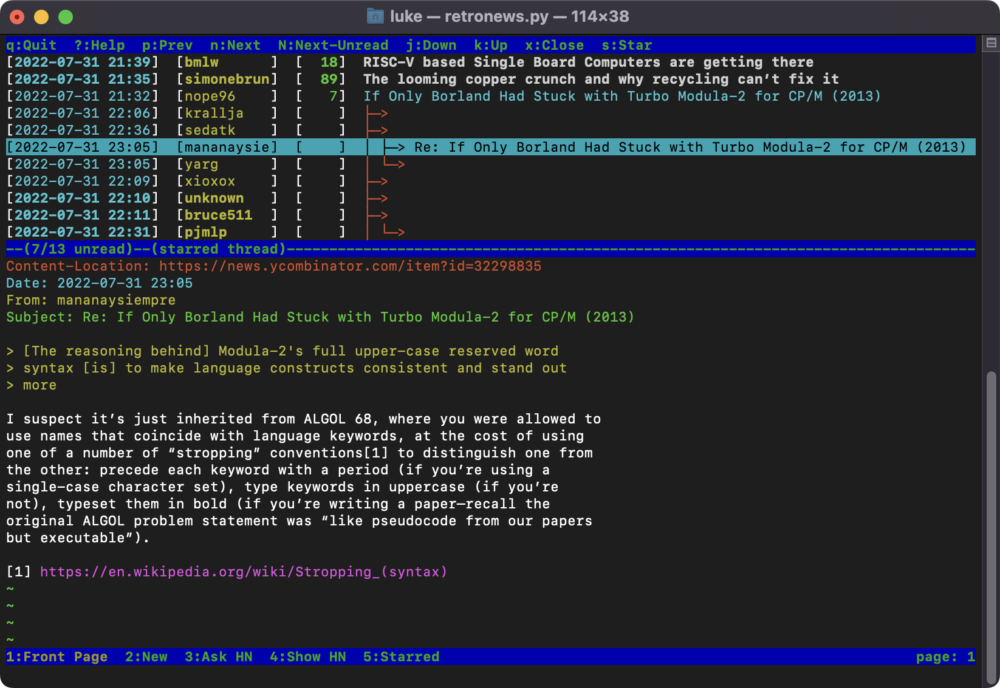

# retronews

A Python script for browsing [Hacker News](https://news.ycombinator.com/)
comments with an interface emulating classical usenet and mail readers,
like slrn and mutt.



## Dependencies

- Python 3.9+ (no external libraries needed)

## Usage

```bash
# Basic
$ ./retronews.py

# Custom
$ ./retronews.py --db ~/.retronews.db --logfile ./tmp/debug.log

# More info
$ ./retronews.py --help
```

## Rationale

#### Why retronews was created?

Hacker News is my favourite discussion board to follow, but I missed support
for highlighting interesting threads and tracking new responses.
Since the messages are mostly plain text, I also thought it'd be fun
to read them like a usenet group.

My initial approach was to build a NNTP gateway for slrn,
similar to [nntpit](https://github.com/taviso/nntpit), but
it turned out not to be feasible.
After some prolonged tinkering I concluded that a standalone app
would be simpler and more elegant.

#### Why not a NNTP gateway?

NNTP operates on a flat list of messages.
The client asks for message headers N to M, uses them to draw a tree, and then
asks one by one for the full content when messages are selected.
There's no support for requesting a list of top-level messages first (let
alone paginated), and fetching their responses only when individual threads are expanded.

The gateway would need to download all threads to display at once, and since the
underlying API can take several seconds per story, it'd be unacceptably slow.
It also wouldn't be possible to request threads from older pages or specified by id.

#### Why not a web application?

The traditional newsreader TUI has several limitations compared to a web app.
It doesn't support opening multiple stories at once in separate
tabs, it shows only one message at a time, it's not available on smartphones,
and it requires one more step to open a link.


These limitations can be seen as a benefit :wink:
They force you to process the information at a slower pace, in
a less compulsive and more focused way.

## Known issues and limitations

- The script is read-only, there are no plans to support voting and posting
- The message renderer has glitches, but I prefer to keep it simple than solve
  every corner case
- No config file is planned, since the code is in Python, it's simpler to
  treat it as its own config and customize directly

## Related projects

- [HN Search @ Algolia](https://hn.algolia.com/about) - The underlying API used to retrieve messages
- [nntpit](https://github.com/taviso/nntpit) - An NNTP gateway to reddit.com
